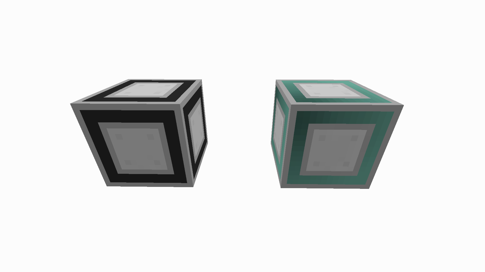
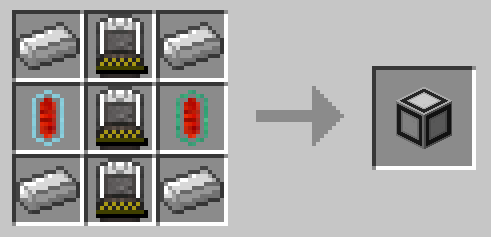
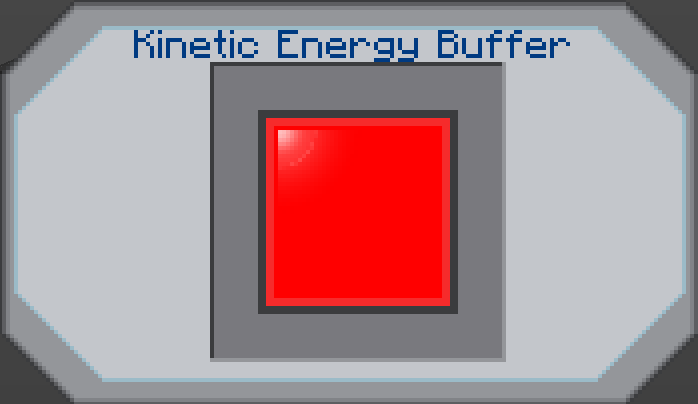

#Basic Kinetic Energy Buffer
The Basic Kinetic Energy Buffer (Or Mini-KEB for short) is a portable power storage block added by BuildCraft Additions. This KEB can hold 300,000,000 Redstone Flux.

Left: Uncharged, Right: Charged

###Recipe

###Usage
The KEB can be charged by directing power into it using BuildCraft Kinesis Pipes or TE FluxDucts. Every side of block is input by default. To change the side I/O, use a machine configurator.  

Inside the interface the energy bar around the red square  will fill up, hovering the cursor over the block will show a tooltip exactly displaying the amount of RF currently in the KEB. And for the red button… Just don’t press it near anything you would like to keep.  To destroy the KEB, simply shift right click on it with a wrench. The KEB will also retain  energy storage. 