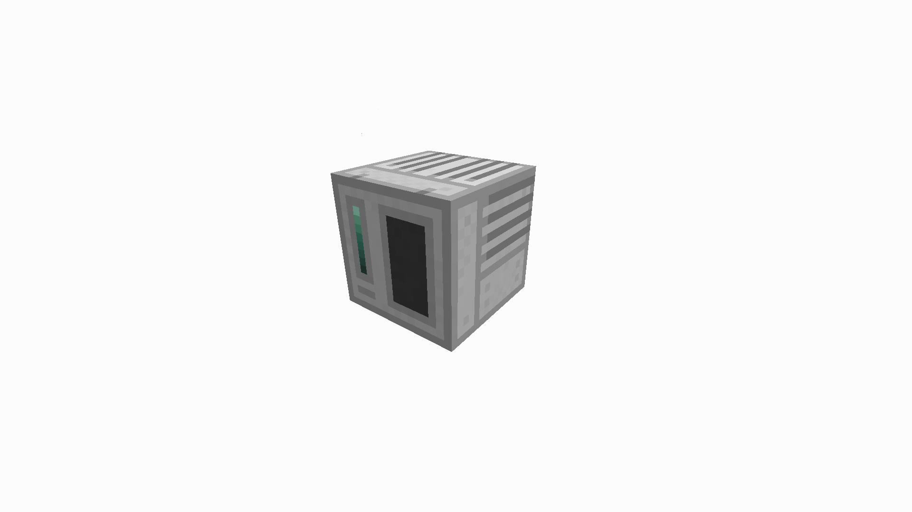
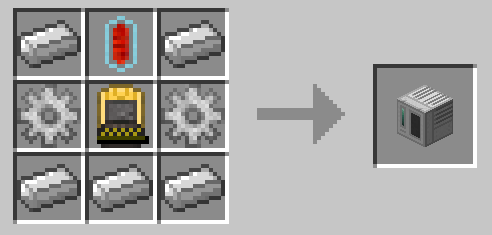

#Charging Station
The Charging Station is a block added by BuildCraft Additions which is able to charge items that require Redstone Flux, such as Kinetic Capsules, TE Flux Capacitors and many other items from other mods. 

###Recipe

###Usage
A constant supply of RF power is needed to charge items. Once the item is fully charged the Charging Station will stop consuming power. 

