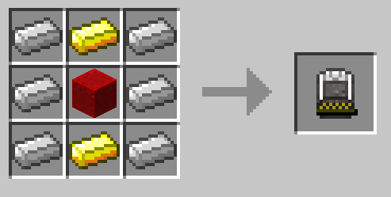

#Charging Station
The Charging Station is a block added by BuildCraft Additions which is able to charge items that require Redstone Flux, such as Kinetic Capsules, TE Flux Capacitors and many other items from other mods. 

###Recipe

###Usage
A constant supply of RF power is needed to charge items. Once the item is fully charged the Charging Station will stop consuming power. 

##Kinetic Capsules
BuildCraft Additions uses Kinetic Capsules for portable power storage. There are three tiers of capsules, each holding a larger amount of RF than the other. These capsules are used for powering key items in BuildCraft Additions such as Kinetic Tools and the Coloring Tool.

+ The T1 Capsule holds 100,000 RF
+ The T2 Capsule holds 300,000 RF
+ The T3 Capsule holds 1,000,000 RF

###Recipes

Tier 1: 

Tier 2: 

Tier 3: 

