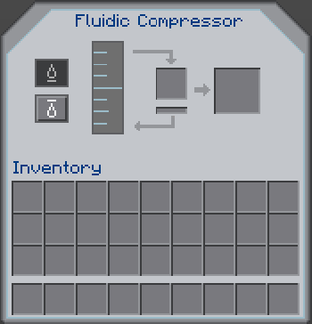

## Fluidic Compressor
The Fluidic Compressor is a block added by BuildCraft Additions which has the ability to compress large amounts of fluid into small canisters using Redstone Flux.

### Recipes

The Fluidic Compressor is created using 3 gold ingots, 2 iron ingots, 2 pistons, 1 gold canister and 1 flux conductor

### Usage
Players must insert fluid into the Fluidic Compressor using blocks like BuildCraft Pipes, TD Fluiducts or EnderIO Conduits. A canister is then needed to compress the fluid into. All three tiers of canister can b used. 

+ The Tier 1 canister can hold 2 buckets of fluid

+ The Tier 2 canister can hold 8 buckets of fluid

+ The Tier 3 canister can hold 64 buckets of fluid 

Within the Compressor's interface, there is the ability to switch the machine's function from filling the canisters to draining them via the two buttons on the left. This functionality is useful for long distance fluid transportation. The centre item slot is used for inserting the fluid canister. The outputted canister will appear in the right slot. The whole compressing operation requires RF power.

