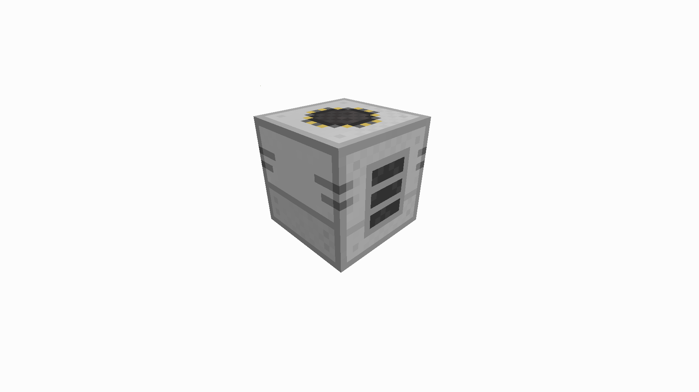
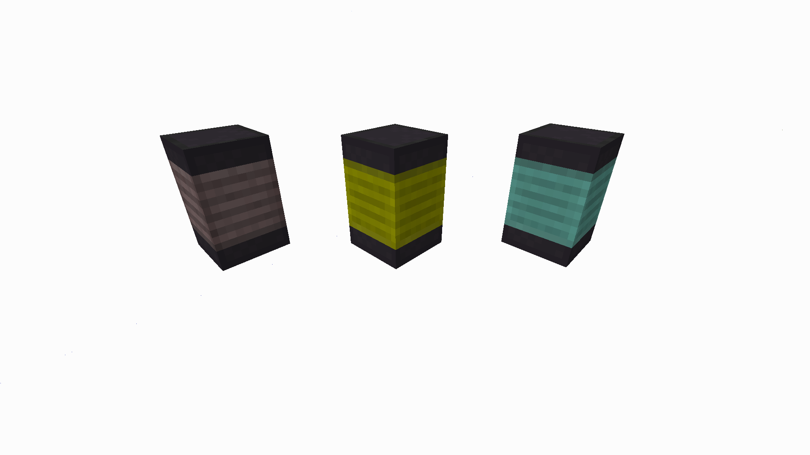
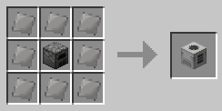
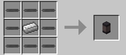
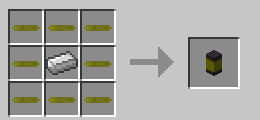
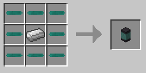

#Heated Furnace
The Heated Furnace is a block added by BuildCraft Additions which can smelt items at a faster and more efficient rate. 

This furnace does nothing on it's own though, and requires surrounding Coils to give it heat energy. There are three types of coil, the Basic Coil, Lava Coil and the Kinetic Coil. These use coal, lava and BC laser energy respectively.

###Recipes

###Usage
Coils must be placed next to the Heated Furnace to transfer energy. A fuel source must be inserted into the coils, and an ingredient through the main furnace. The furnace will only consume fuel when needed and vastly increases the efficiency of fuels compared to the vanilla furnace.