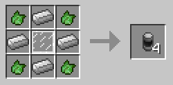
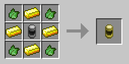
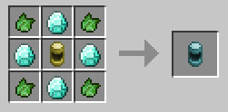

#Canisters
Fluid Canisters are portable fluid storage items added by BuildCraft Additions. These canisters are not like normal fluid storage items, as they require compressed fluid from the Fluidic Compressor. There are three tiers of the fluid canister. 

+ The Tier 1 canister can hold 2 buckets of fluid

+ The Tier 2 canister can hold 8 buckets of fluid

+ The Tier 3 canister can hold 64 buckets of fluid 

The Fluidic Compressor is required to fill and drain these capsules.

### Recipes
Tier 1: 

Tier 2: 

Tier 3: 
