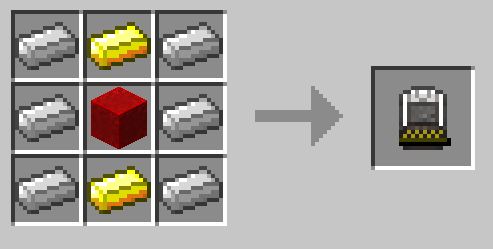
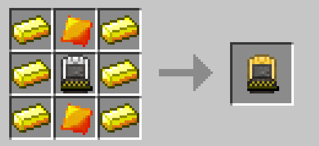
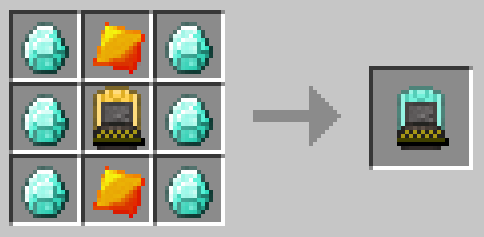

#Kinetic Capsules
BuildCraft Additions uses Kinetic Capsules for portable power storage. There are three tiers of capsules, each holding a larger amount of RF than the other. These capsules are used for powering key items in BuildCraft Additions such as Kinetic Tools and the Coloring Tool. The capsules can be charged in machines like the Charging Station, TE Energetic Infuser and the BuildCraft Charging Table. 

+ The T1 Capsule holds 100,000 RF
+ The T2 Capsule holds 300,000 RF
+ The T3 Capsule holds 1,000,000 RF

###Recipes

Tier 1: 

Tier 2: 

Tier 3: 

