## Cooling Tower
The cooling tower is the second machine used in the process of converting Oil into Fuel. The previous machine: the Refinery was used in the conversion of raw Oil into Fuel Gas, this machine will consume Fuel Gas and Water to create Fuel.

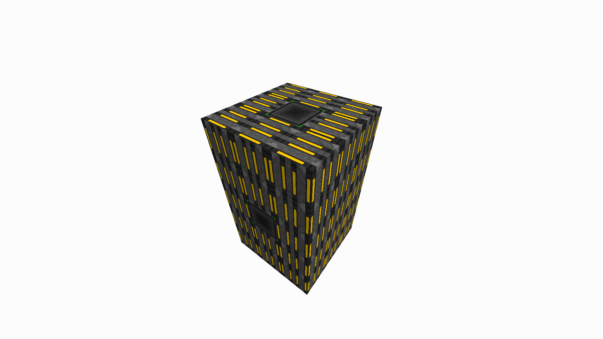

### Structure
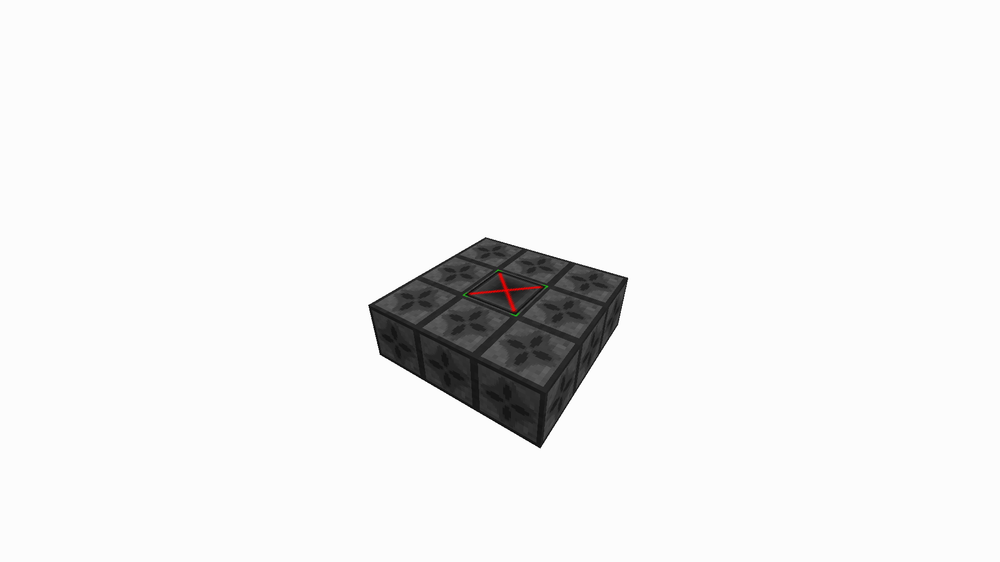
First, 
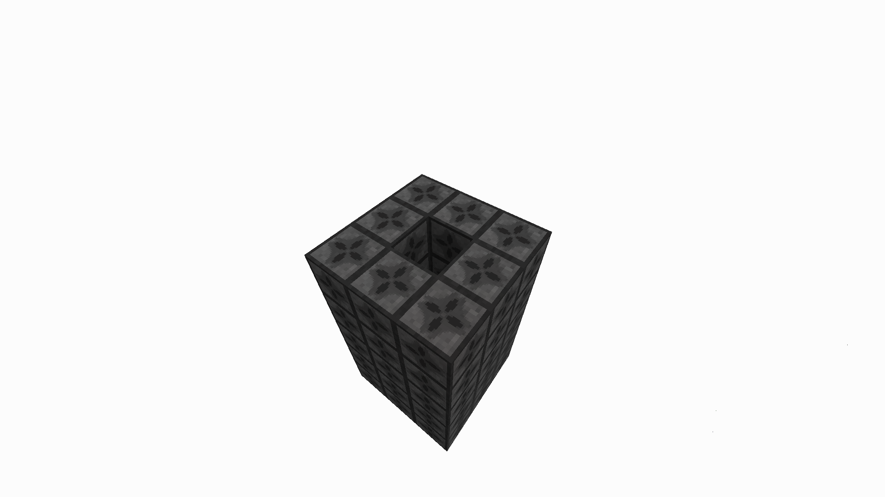
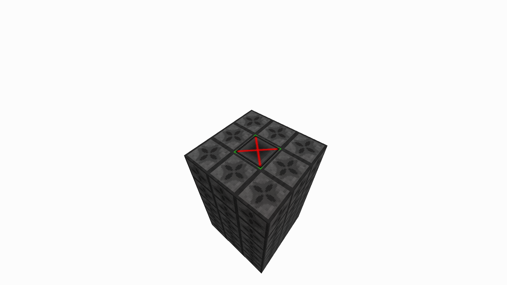
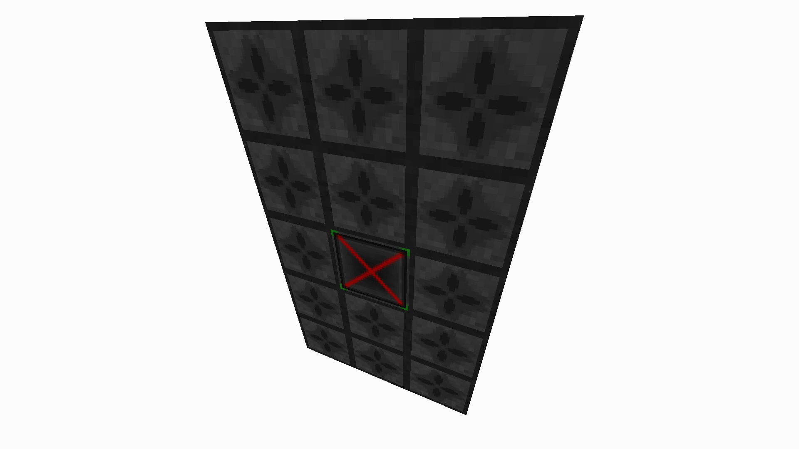 

### Recipes
#### Cooling Tower Wall
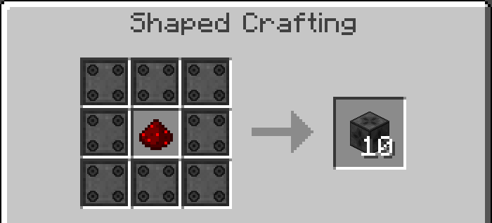

8 Heat Conductive Plating surrounding 1 redstone yields 10 Cooling Tower Walls.

#### Cooling Tower Valve
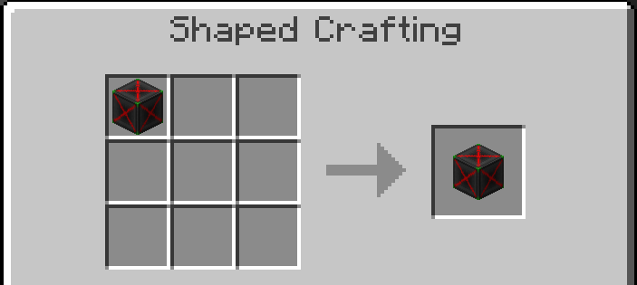

A refinery valve is directly crafted into a Cooling Tower Valve.

### Usage
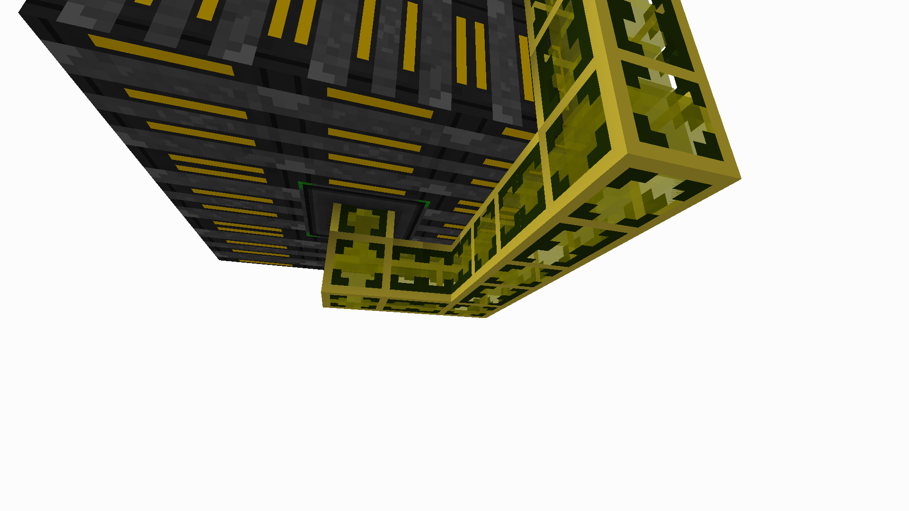

Insert Fuel Gas from the bottom of the multiblock.

You will start to notice the Fuel Gas being converted into Fuel, and the heat bar going up. Once the heat bar is at maximum, the creation of fuel will stop.

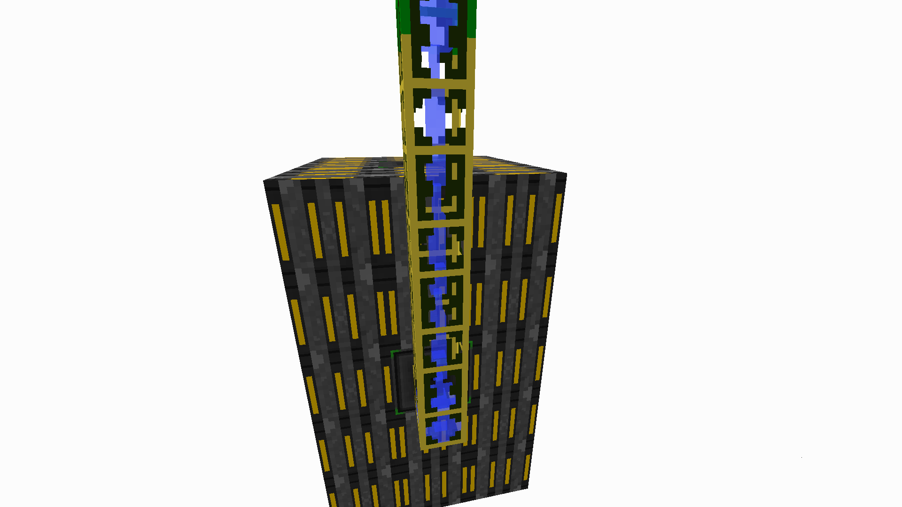

Insert water into the side valve of the structure.

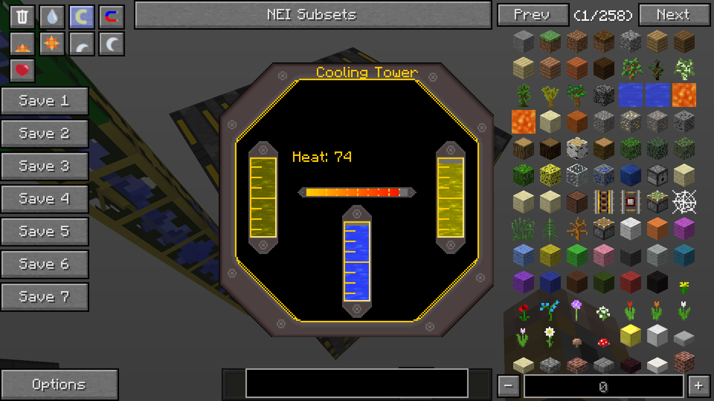

The water will keep the heat at a steady temperature, allowing the creation of Fuel to continue.

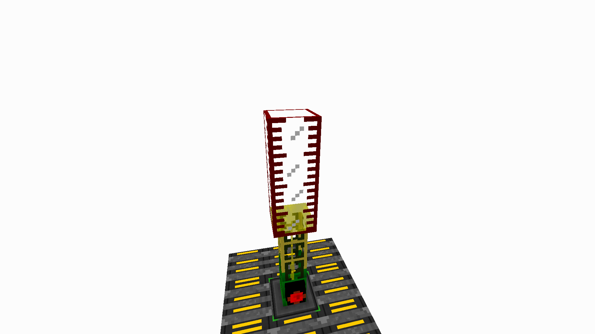