## Refinery
The Refinery is one of many multiblock structures included in BuildCraft Additions. This machine has the capability to convert oil into Fuel Gas, which is used in the process of making Fuel.

This machine is the first in two processes of converting Oil into Fuel, the other being the Cooling Tower.

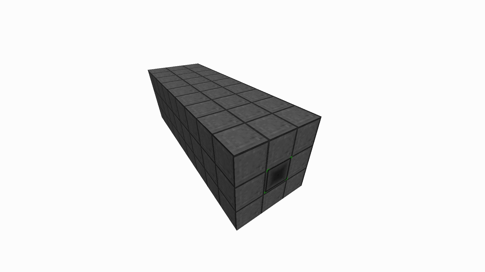

The multiblock structure is made out of two main blocks, Refinery Plating and Refinery Valves.

### Structure
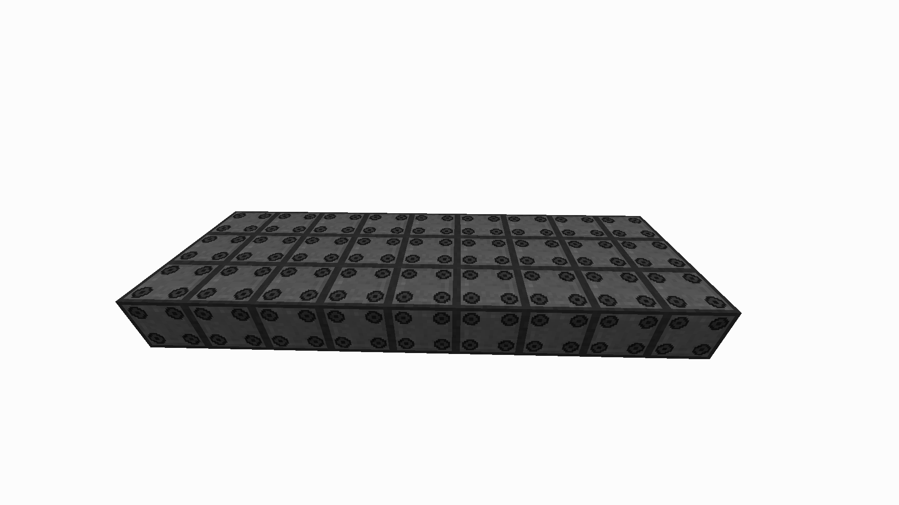
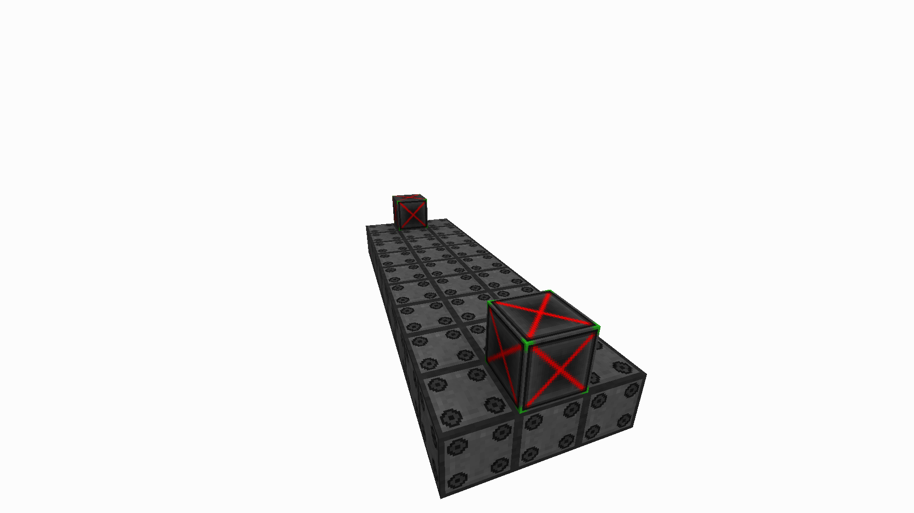
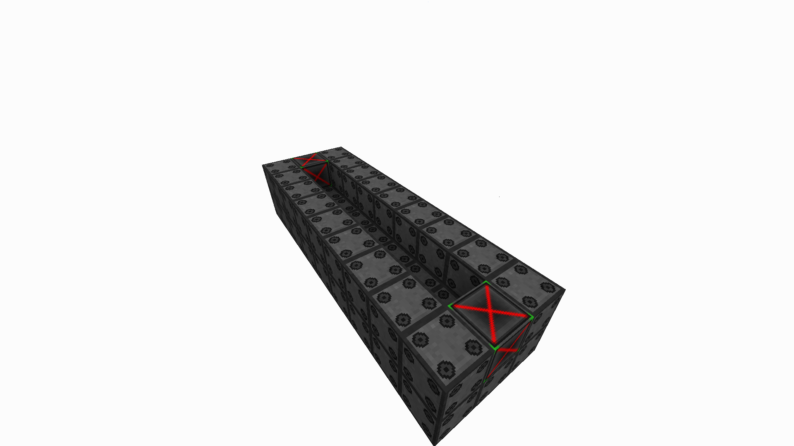
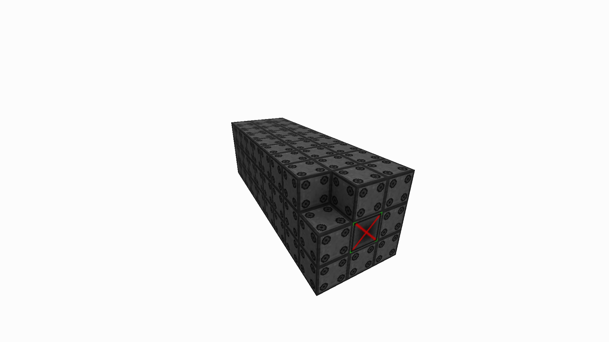

### Recipes
#### Refinery Wall Recipe
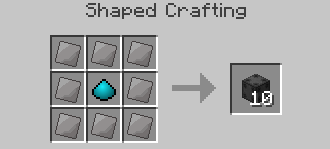

#### Refinery Valve Recipe
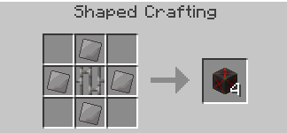

### Usage
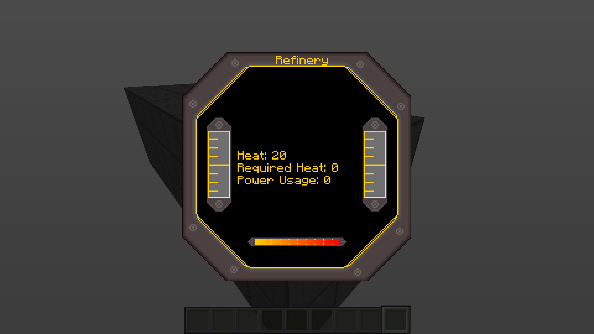
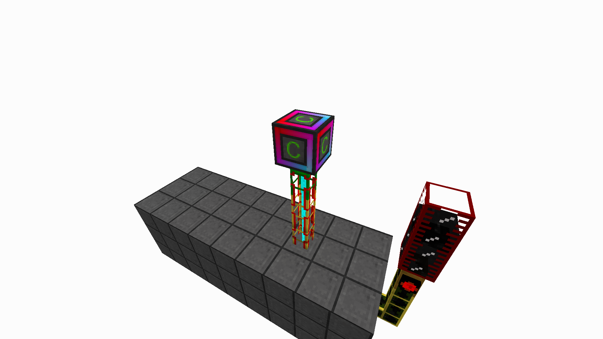

You will find the bar at the bottom of the GUI will start to move, reaching full heat. You can see the required heat. Once the threshold is met, the refinery will start converting Oil into Fuel Gas.

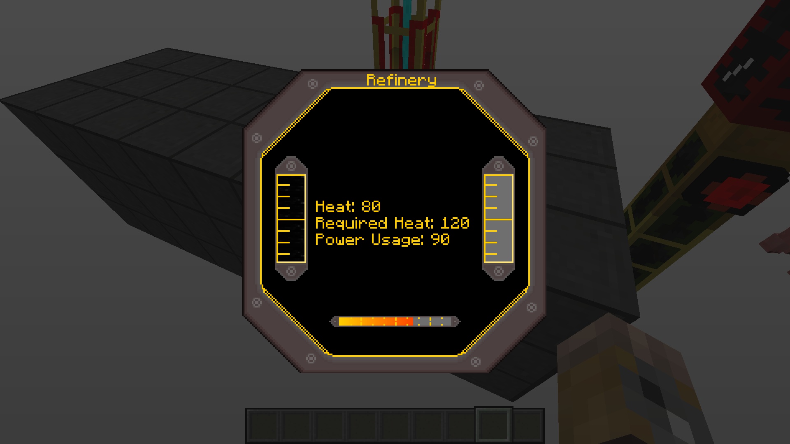
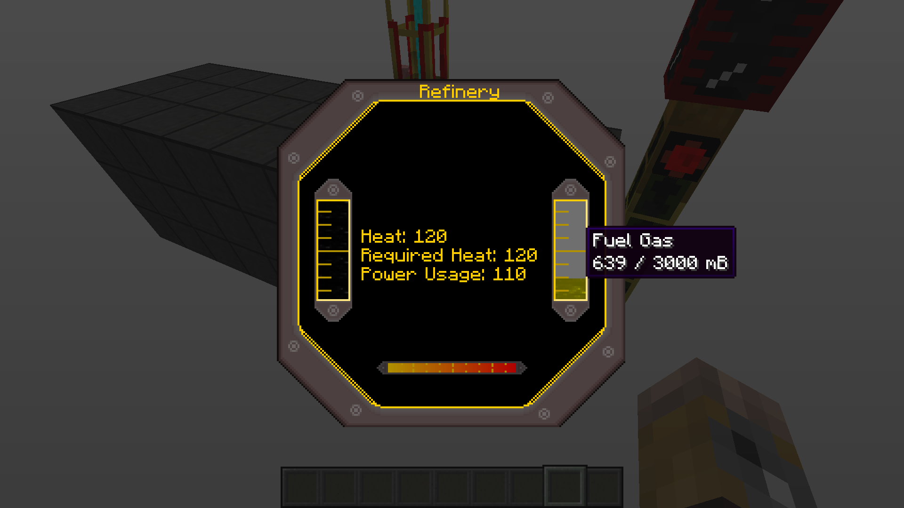

To process the Fuel Gas into a useable energy source, you will have to use the next machine: [The Cooling Tower.](./Cooling Tower.md)
